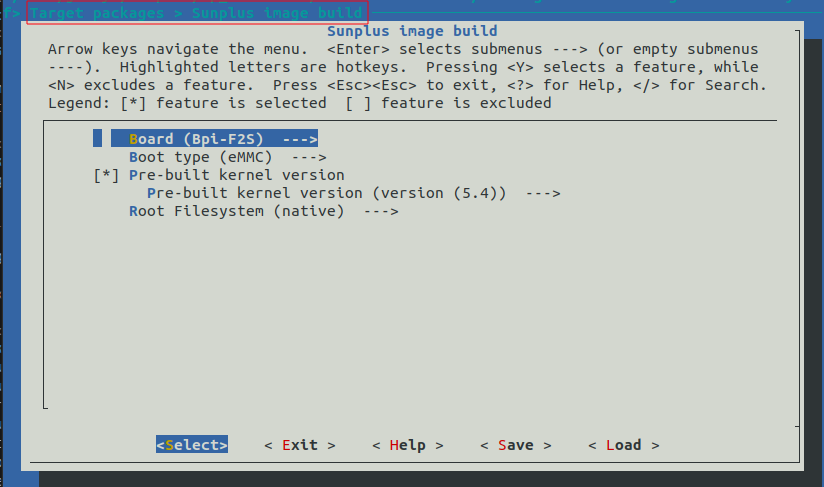

# How to setup sunplus image build for buildroot
>#### 1). run install.sh
```bash
./install.sh
```
enter to your buildroot directory
```bash
cd buildroot-2022.11/
```
>#### 2). make default config
If you are using SP7021 BPI-F2S, BPI-F2P or DemoV3 boards, please: 
```bash
make sp_bpi_xxx_defconfig
```
If you are using Q645 EV board or SP7350 EV board, please:
```bash
make sp_q6xx_defconfig
```
>#### 3). make menuconfig
* Select your target board.
* select your boot type.
* select kernel. 
    * pre-built kernel
    * non pre-built
        * it's will download latest source code from Github to build
* Select root file-system:
    * Buildroot. (it's will build rootfs of buildroot)
    * Ubuntu MATE. 
    * Raspbian OS.



>#### 4). sunplus image build
```bash
make sp_build
```
* if you build source code
    * please install:
    ```bash
    sudo apt-get install openssl libssl-dev bison flex git make u-boot-tools libmpc-dev libgmp-dev pip
    ```
    and 
    ```bash
    pip install pycryptodomex pyelftools Crypto
    ```
    * if you change "kernel version, boards, boot type" after runing "make menuconfig", please re-make the config
    ```bash
    make sp_build CONFIG=y
    ```
    * if you just want to build rootfs of buildroot, you can run
    ```bash
    make sp_build CONFIG=n COMPILE=n
    ```
    * re-download source code or pre-built image
    ```bash
    make sp_clean
    make sp_build
    ```
